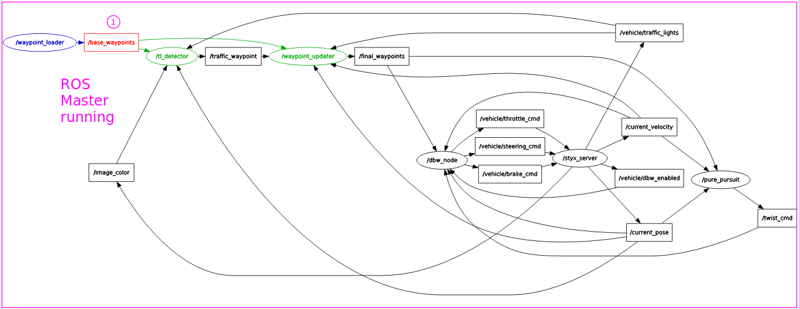
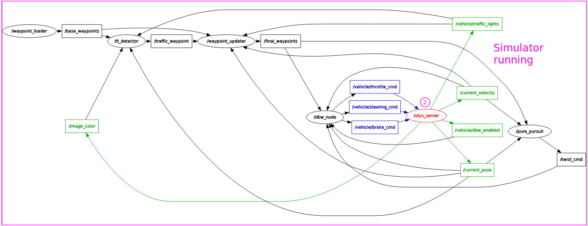
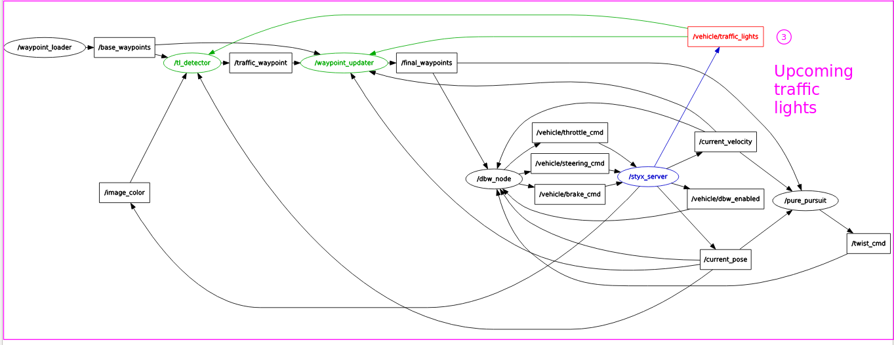
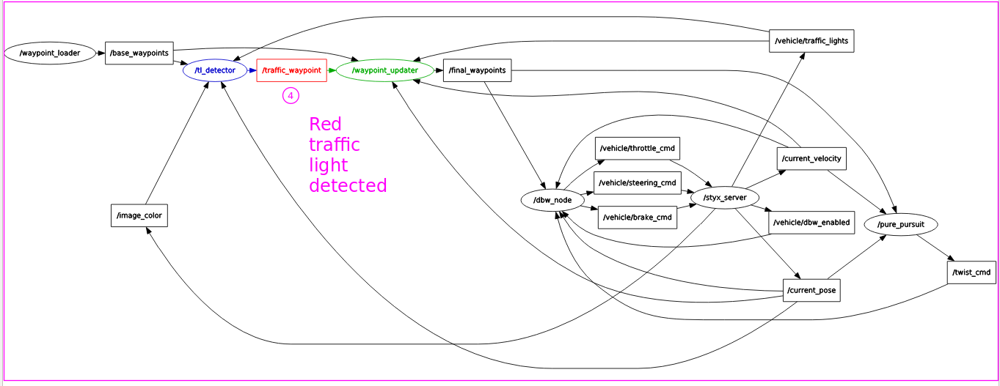
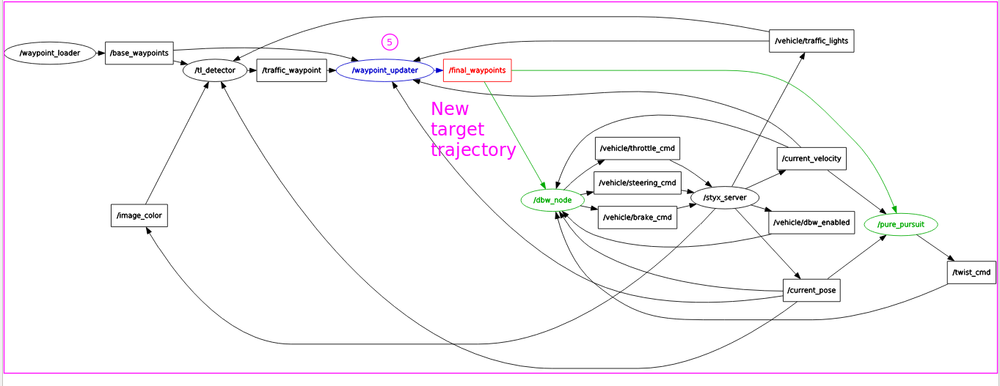
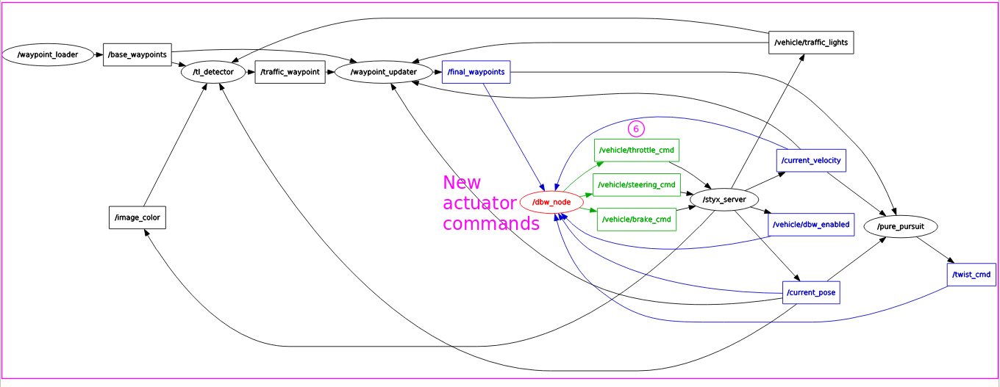

# Programming a Real Self-Driving Car
## Capstone Project
* Project Submission Due : 23/Oct/2017
* Term 3 End : 6/Nov/2017

---

### RoboFolks Team
1. #### Perception
    * Evotianus Benedicto: evotianusx@gmail.com (Deep Learning Lead)
    * Rohit Patil: rohts.patil@gmail.com
1. #### Planning
    * An Nguyen: anguyen3@rockets.utoledo.edu (RoboFolks Team Lead)
1. #### Control 
    * Andrew Wilkie: andrew.d.wilkie@gmail.com (Control & Document Lead)
    * Quiang Lu: buaaluqiang@hotmail.com

---

### RoboFolks Documentation

Project Introduction: 
[presentation](https://docs.google.com/presentation/d/13xbwB789J7PuLtkmzdOygla4M4J5GBxbD6bkOSd4STs/edit?usp=sharing)

0. High level architecture from course lesson


1. ROS Master running


1. Simulator running


1. Upcoming traffic lights


1. Red traffic light perceived


1. New target trajectory planned


1. New commands for car actuators


1. [See API for more details on above diagrams](https://ancabilloni.github.io/Autonomous_System_Integration/#)

    7.1 OPTIONAL : How to generate and view [Sphinx](https://codeandchaos.wordpress.com/2012/07/30/sphinx-autodoc-tutorial-for-dummies/) API
```bash
cd <cloned_folder>/ros/src/doc
vim conf.py
vim index.rst
make clean
make html
cd _build/html/
python -m SimpleHTTPServer
cp -r * <cloned_folder>/docs/
```

8. [Github](https://github.com/ancabilloni/Autonomous_System_Integration)

---

### Submission Checklist and Requirements
1. - [x] Smoothly follow waypoints in the simulator.
1. - [x] Stop at traffic lights when needed.
1. - [x] Stop and restart PID controllers depending on the state of /vehicle/dbw_enabled.
1. - [x] **Speed Limit**: Be sure to respect the speed limit set by the velocity param (km/h) in waypoint_loader

---

### Simulator Results
* 
* [Full lap video](https://youtu.be/FfqRF8RTDv0)
---

### Test Drive Results
* TODO

---

This is the project repo for the final project of the Udacity Self-Driving Car Nanodegree: Programming a Real Self-Driving Car. For more information about the project, see the project introduction [here](https://classroom.udacity.com/nanodegrees/nd013/parts/6047fe34-d93c-4f50-8336-b70ef10cb4b2/modules/e1a23b06-329a-4684-a717-ad476f0d8dff/lessons/462c933d-9f24-42d3-8bdc-a08a5fc866e4/concepts/5ab4b122-83e6-436d-850f-9f4d26627fd9).

### Native Installation

* Be sure that your workstation is running Ubuntu 16.04 Xenial Xerus or Ubuntu 14.04 Trusty Tahir. [Ubuntu downloads can be found here](https://www.ubuntu.com/download/desktop).
* If using a Virtual Machine to install Ubuntu, use the following configuration as minimum:
  * 2 CPU
  * 2 GB system memory
  * 25 GB of free hard drive space

  The Udacity provided virtual machine has ROS and Dataspeed DBW already installed, so you can skip the next two steps if you are using this.

* Follow these instructions to install ROS
  * [ROS Kinetic](http://wiki.ros.org/kinetic/Installation/Ubuntu) if you have Ubuntu 16.04.
  * [ROS Indigo](http://wiki.ros.org/indigo/Installation/Ubuntu) if you have Ubuntu 14.04.
* [Dataspeed DBW](https://bitbucket.org/DataspeedInc/dbw_mkz_ros)
  * Use this option to install the SDK on a workstation that already has ROS installed: [One Line SDK Install (binary)](https://bitbucket.org/DataspeedInc/dbw_mkz_ros/src/81e63fcc335d7b64139d7482017d6a97b405e250/ROS_SETUP.md?fileviewer=file-view-default)
* Download the [Udacity Simulator](https://github.com/udacity/CarND-Capstone/releases/tag/v1.2).

### Docker Installation
[Install Docker](https://docs.docker.com/engine/installation/)

Build the docker container
```bash
docker build . -t capstone
```

Run the docker file
```bash
docker run -p 4567:4567 -v $PWD:/capstone -v /tmp/log:/root/.ros/ --rm -it capstone
```

### Usage

1. Clone the project repository
```bash
git clone https://github.com/udacity/CarND-Capstone.git
```

2. Install python dependencies
```bash
cd CarND-Capstone
pip install -r requirements.txt
```
3. Make and run styx
```bash
cd ros
rm -rf build
rm -rf devel
catkin_make
source devel/setup.sh
roslaunch launch/styx.launch
```
4. Run the simulator

### Real world testing
1. Download [training bag](https://drive.google.com/file/d/0B2_h37bMVw3iYkdJTlRSUlJIamM/view?usp=sharing) that was recorded on the Udacity self-driving car (a bag demonstraing the correct predictions in autonomous mode can be found [here](https://drive.google.com/open?id=0B2_h37bMVw3iT0ZEdlF4N01QbHc))
2. Unzip the file
```bash
unzip traffic_light_bag_files.zip
```
3. Play the bag file
```bash
rosbag play -l traffic_light_bag_files/loop_with_traffic_light.bag
```
4. Launch your project in site mode
```bash
cd CarND-Capstone/ros
roslaunch launch/site.launch
```
5. Confirm that traffic light detection works on real life images

---
